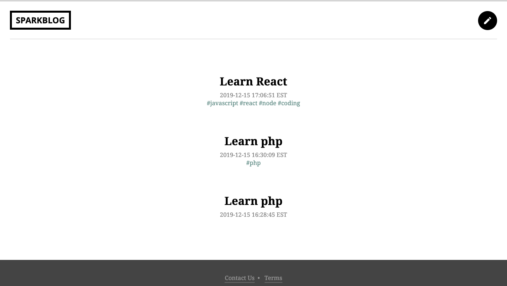
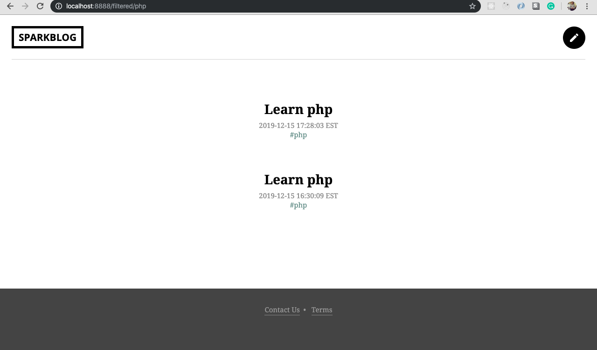
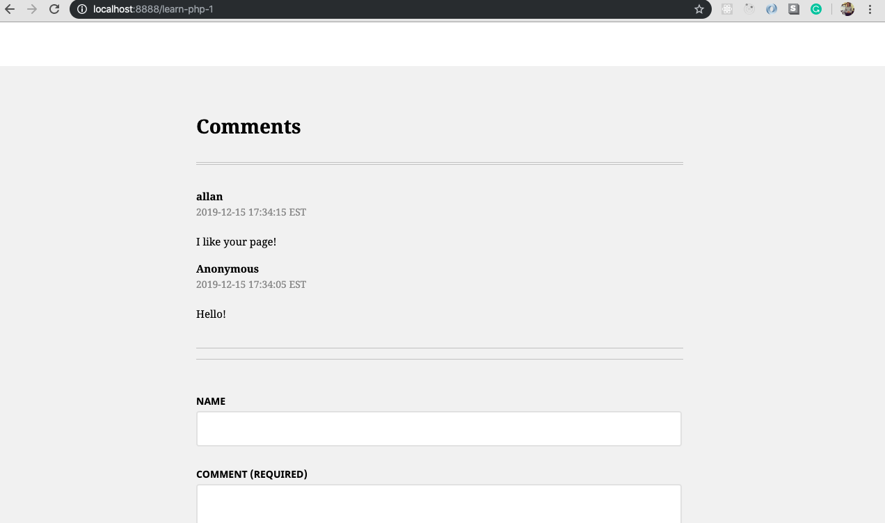
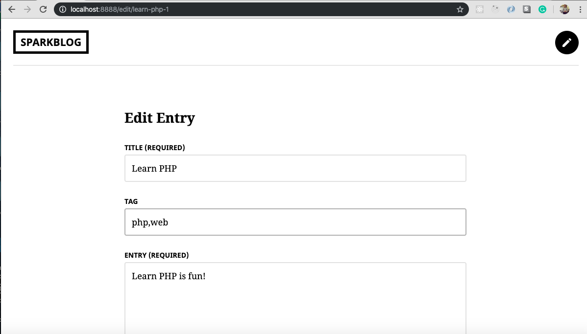
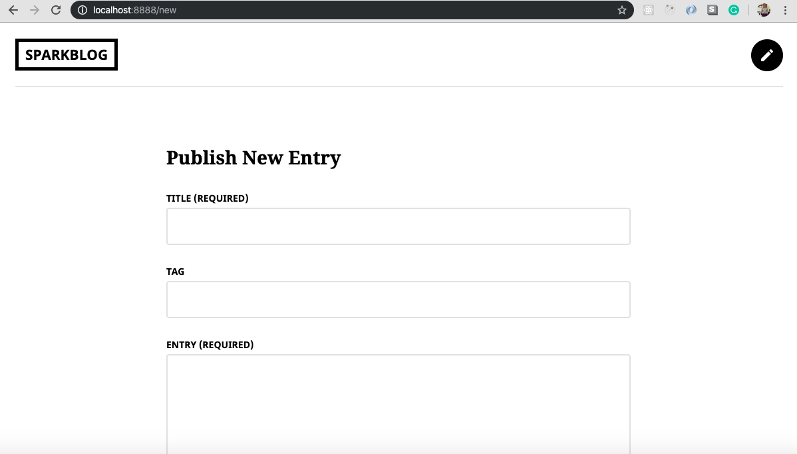

# A-Slim-Blog

**A-Slim-Blog** 

The Slim blog build with PHP Slim framework 3. It utilized around the CRUD operation. This app allows the user to post an entry with the optional tags. Also, it allows the users to post comments on one entry. The Slim blog is the part of my learning journey with the teamtreehouse.com. It demonstrated my ability to use a framework to build out a fully functional CRUD app (one-one, one-to-many, many-to-many). 

Note: 

Teamtreehouse.com PHP Techdegree exceeding grade changes: ability to delete the posts, allowing to add tags, SEO friendly slug.

## How to setup on local machine

git clone https://github.com/allan9595/A-Slim-Blog.git

Place the repo in a web server of your choice (XAMPP for Windows, MAMP for Mac)

Open a terminal and type in "composer install" 

Then "composer dumpautoload -o"

Go to your web server's root path and navigate to the project root folder and start to play!

## Screenshots

## License

   The MIT License

    Copyright (c) BOHAN ZHANG

    Permission is hereby granted, free of charge, to any person obtaining a copy
    of this software and associated documentation files (the "Software"), to deal
    in the Software without restriction, including without limitation the rights
    to use, copy, modify, merge, publish, distribute, sublicense, and/or sell
    copies of the Software, and to permit persons to whom the Software is
    furnished to do so, subject to the following conditions:

    The above copyright notice and this permission notice shall be included in
    all copies or substantial portions of the Software.

    THE SOFTWARE IS PROVIDED "AS IS", WITHOUT WARRANTY OF ANY KIND, EXPRESS OR
    IMPLIED, INCLUDING BUT NOT LIMITED TO THE WARRANTIES OF MERCHANTABILITY,
    FITNESS FOR A PARTICULAR PURPOSE AND NONINFRINGEMENT. IN NO EVENT SHALL THE
    AUTHORS OR COPYRIGHT HOLDERS BE LIABLE FOR ANY CLAIM, DAMAGES OR OTHER
    LIABILITY, WHETHER IN AN ACTION OF CONTRACT, TORT OR OTHERWISE, ARISING FROM,
    OUT OF OR IN CONNECTION WITH THE SOFTWARE OR THE USE OR OTHER DEALINGS IN
    THE SOFTWARE.